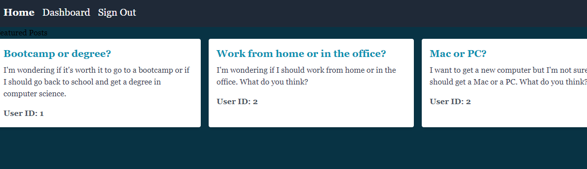

# Tech blog

 

## Description
The tech blog allows users to create an account, login, and post blogs. Users can also comment on other users blogs.

## Table of Contents
* [Description](#description)
* [Installation](#installation)
* [Usage](#usage)
* [Contribution](#contribution)
* [Test](#test)
* [Links](#links)
* [Questions](#questions)
* [Screenshot](#screenshot)
* [License](#license)

## Installation
No prior installation is required. Just go to the deployed link and create an account.

## Usage
To use the tech blog go to the deployed link and create an account. Once you have an account you can post blogs and comment on other users blogs.

## Contribution
Current deployed site does not have a functioning logout or post route. If you would like to contribute to this project please contact me at the email below as this is a work in progress.

## Test
n/a

## Questions
You can reach me with questions at Exe@AOL.com.
GitHub: OliveraDiaz

## Links
Live site: https://blogapp546-ebc35ea653bf.herokuapp.com/
Github link: https://github.com/OliveraDiaz/TechBlog.git

## Screenshot

